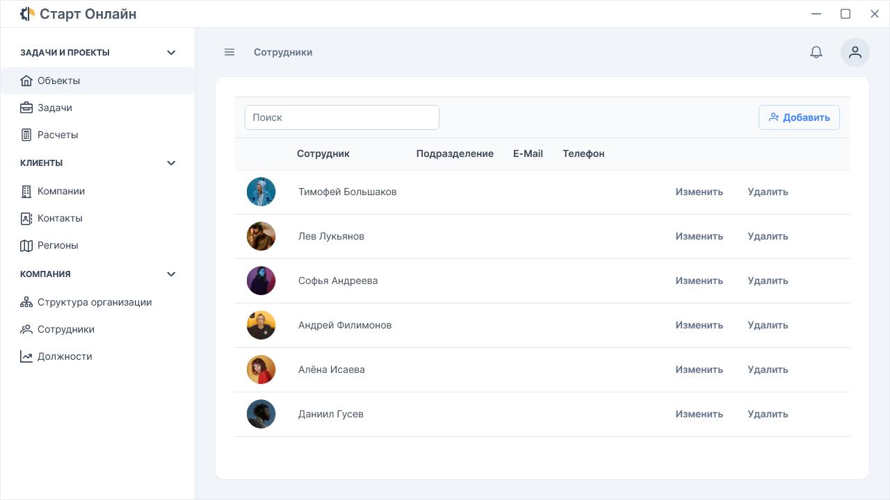

# WpfCmsDemo
Фулстек демонстрационное приложение CMS, построенное на WPF (клиентская часть) и ASP.NET WebAPI (серверная часть).

# Клиентская часть (Remake.Client)

## ⭐ Особенности
- **Архитектура MVVM** - реализация шаблона Model-View-ViewModel для разделения логики и интерфейса.
- **Dependency Injection (DI)** - встроенная система внедрения зависимостей для гибкого управления модулями.
- **Prime.Wpf** - кастомная библиотека UI-компонентов и стилей, вдохновлённая веб-библиотекой [Prime](https://www.primefaces.org/).
- **Аутентификация** - система входа с использованием логина и пароля.
- **Сервисы приложения:**
    - **NavigationService** - навигация между страницами.
    - **DialogService** - отображение модальных окон.
    - **MessageService** - вывод toast-уведомлений.

## ⚙️ Функционал
- Авторизация пользователей.
- CRUD-операции с данными сотрудников (просмотр, добавление, редактирование, удаление).

## 🚧 Недоработки и планы
- Валидация форм.
- Вынести **Prime.Wpf** в отдельный NuGet-пакет.
- Добавить модульное (Unit-тесты) и интеграционное тестирование.

# Серверная часть (Remake.Server)

## ⭐ Особенности
- **Entity Framework Core (EF)** - ORM для работы с базой данных.
- **Microsoft SQL Server (MSSQL)** - реляционная СУБД для хранения данных.
- **JWT-аутентификация:**
    - **Access Token** - краткосрочные токены доступа.
    - **Refresh Token** - механизм обновления токенов без повторного ввода учётных данных.

## 🚧 Недоработки и планы
- Расширение системы ролей и прав доступа.
- Связь между сущностями **User** и **Employee**.
- Возможность добавления сотрудника в качестве пользователя.
- Подтверждение электронной почты.